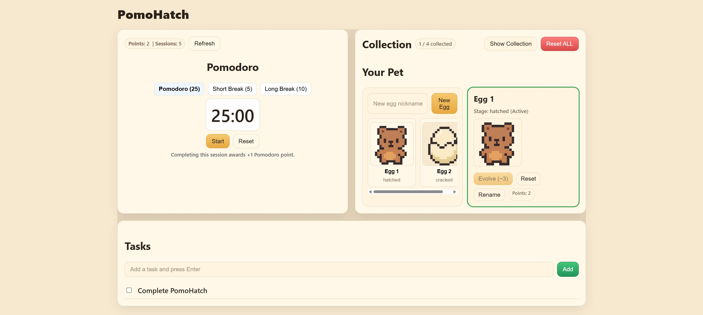

# PomoHatch 🥚⏱️

A cozy Pomodoro + pet-collection app. Finish focus sessions to earn points, crack & hatch eggs, evolve pets, and keep a simple task list—wrapped in a warm, minimal UI.



---

## Features

- **Pomodoro timer**: Focus 25 min, Short break 5 min, Long break 10 min  
  - title bar shows time: `PomoHatch — mm:ss (Focus/Break)`  
  - break completion can loop a chime until **Reset**
- **Points**: +1 point only for completed Focus (25 min) sessions
- **Evolution flow**: `egg → cracked (−1) → hatched (−1) → evolved (−3)`  
  - random species on hatch, avoids duplicates until all collected
  - one **active** egg/pet at a time; switch via sidebar
  - per-species **evolved art** (optional)
- **Collection drawer**: collapsible “Show Collection” with small thumbnails; shows evolved image if unlocked
- **Task list**: add tasks, click to complete (and they disappear)
- **Sounds**: completion, crack, hatch, evolve (short, friendly SFX)
- **Reset**: one-click reset points and pets to eggs (no page refresh)

---

## Tech stack

- **Backend**: Django, Django REST Framework, django-cors-headers, Pillow  
- **Frontend**: React, Axios, plain CSS (theme tokens)  
- **Dev media**: served from `/media/` in Django (DEBUG)  

---

## Getting started

### Prereqs
- Python 3.11+, Node 18+, Git  
- Windows users: run commands in **PowerShell**

### 1) Backend (Django)

```powershell
cd backend
python -m venv venv
venv\Scripts\Activate.ps1
pip install -r requirements.txt
# If you don't have requirements.txt yet:
# pip install django djangorestframework django-cors-headers Pillow

python manage.py migrate
python manage.py createsuperuser  # optional, to upload species images
python manage.py runserver
``` 
### 2) Frontend (React)
```powershell
cd ../frontend
npm install
npm start
```


